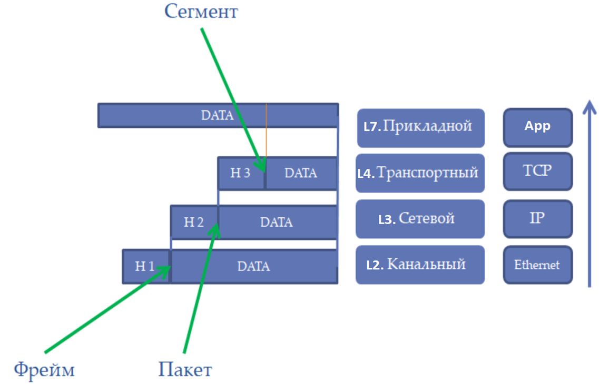
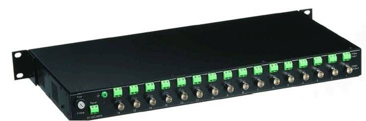
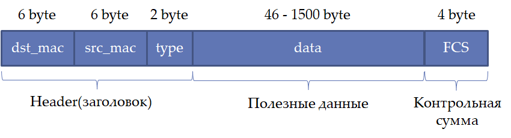
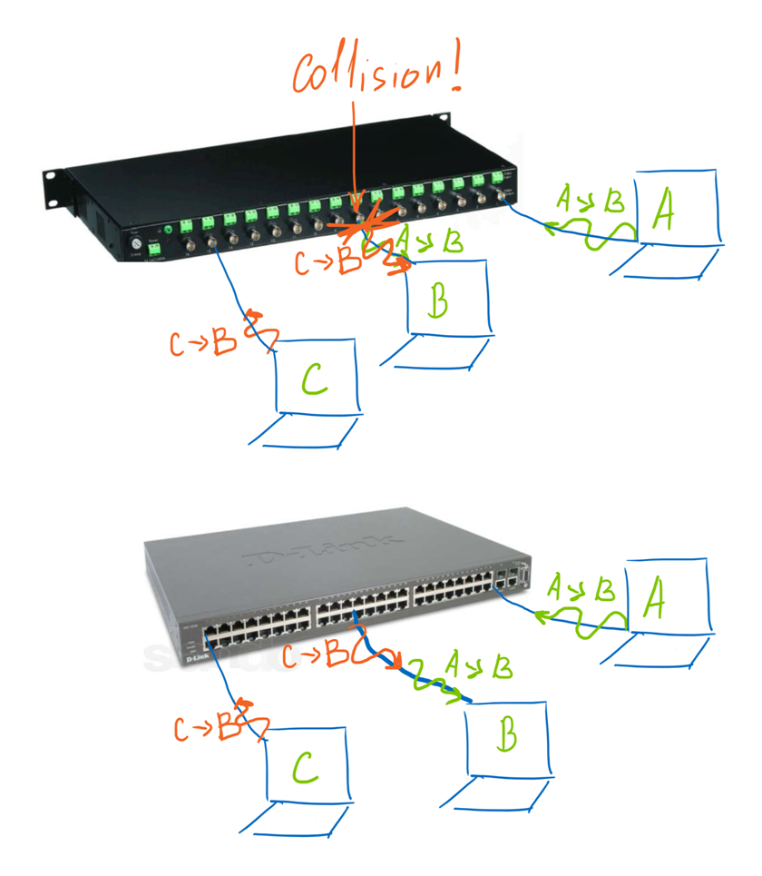

# Основы  компьютерных сетей. Технология Ethernet.
---
---
## 1. Виды связей.
---

### Simplex - односторонняя связь.

`Один источик данных, а остальные все только получают эти данные`

- Теле- и радиовещание
- Передача сигнала от спутников GPS

### Half-duplex - двусторонняя связь.

`В один момент времени данные может передавать только одно устройство`

- Общение по рации

### Full-duplex или просто duplex - двусторонняя передача.

`Оба устройства могут одновременно вести передачу`

- Разговор по телефону

## 2. Виды коммутации.
---

### Коммутация каналов

В сети с коммутацией каналов между двумя конечными устройствами устанавливается физический канал. Например - телефонная сеть.

### Коммутация пакетов

В сети с коммутацией пакетов информация от каждого устройства делится на небольшие пакеты, и данные передаются по одним и тем же физическим каналам. Например - компьютерная сеть.

## 3. Методы передачи данных.
---

### Unicast - передача данных единственному адресату.

### Broadcast - широковещательная передача данных всем устройствам.

### Multicast - передача данных группе устройств.

## 4. Классификация и топология сетей.
---

### LAN и WAN

Классификация сетей по административно-территориальному признаку.

`LAN - локальная вычислительная сеть Local Area Network.`
`WAN - Wide Area Network, окружающая нас сеть`

## 5. Модель OSI и TCP/IP.
---

На данный момент принято брать за основу стек - TCP/IP.

`Во время формирования пакета данных он формируется из несколько сегментов на каждом сетевом уровне.`

## 6. Уровни L1 и L2.
---

### Основные протоколы семейства Ethernet(IEEE 802.3)

- 10BASE-T или просто Ethernet. Скорость - `10 Мбит/с, half-duplex/duplex.`
- 100BASE-T или Fast Ethernet. Скорость - `100 Мбит/с, duplex.`
- 1000BASE-T или Gigabit Ethernet. Скорость - `1000 Мбит/с, duplex, используются 4 пары витой пары.`
- 10GBASE-T или 10 Gigabit Ethernet. Скорость 10000 Мбитс/с. Скорость - `10000 Мбит/с, duplex, используются 4 пары в специальной витой паре.`

Для всех стандартов можно применять витую пару разных категорий. У всех стандартов ограничение по длине кабеля - `100 метров.`

Большинство устройств поддерживают `автосогласование скорости.`

### Коаксиальный кабел

Имеет всего один проводник для передачи данных и защитную оплётку от помех. `Низкая скорость - до 10 Мбит/с.`

### Hub

Ранее сети строились на коаксиальных кабелях, которые замыкались с помощью хаба.

### Витая пара

В отличии от коаксиала, позволяет передавать цифровую передачу данных, замыкая/размыкая цепь.
Скорость:
- `до 100 Мбит/с`
- Если использовать `8 жил` - `до 1 Гбит/с`
- Если использовать `специальные сетевые карты` - `до 10 Гбит/с`

### Оптика

В кабеля вместо электронов используются фотоны для передачи пакетов данных, которые двигаются по тонкому стеклянному проводу.
Позволяет передавать сигнал на расстояние до `50км.`

### Формат Ethernet фрейма

В качестве адресации устройств придумали MAC(media access control) адреса.

MAC адрес - уникальное 6-ти байтовое число, которое принято записывать в HEX виде, например:
- 00-11-95-1C-D8-02

МАС-адрес состоит из двух частей:
- Распределяется между производителями оборудования
- Распределяет самими производителями

Таким образом по MAC-адресу можно понять фирму-производитель оборудования(если адрес не был программно изменен).

Например:

00-11-95-1C-D8-02

00-11-95 - адрес производителя оборудования(Например Apple)
1С-D8-02 - адрес, который устанавливает сам производитель(Например компьютер такой-то с номером такиим-то)

### Hub vs Switch

Hub физически повторяет сигнал на все порты одновременно.

Switch умеет передавать сигналы точечно получателю, при этом он выстраивает пакеты в очередь(проводит буферизацию)

### Сетевые лаборатории

- Cisco Packet Tracer
- eNSP
- EVE-NG
- GNS3