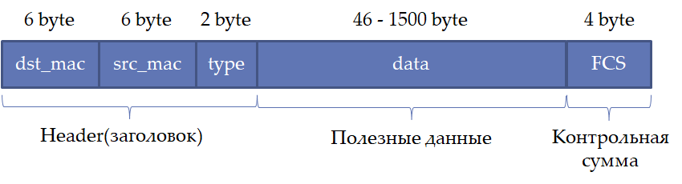
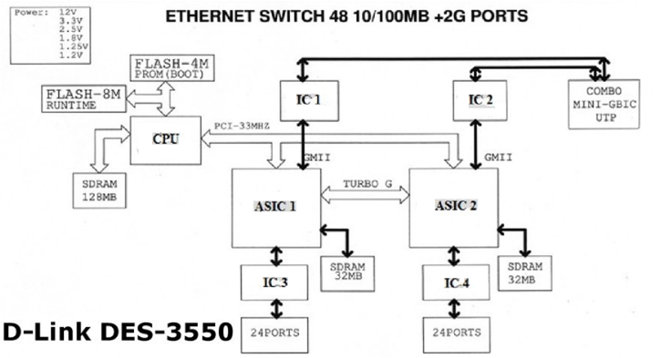
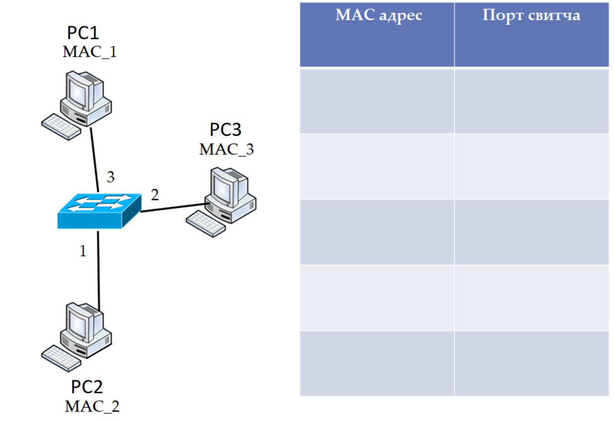
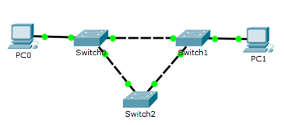
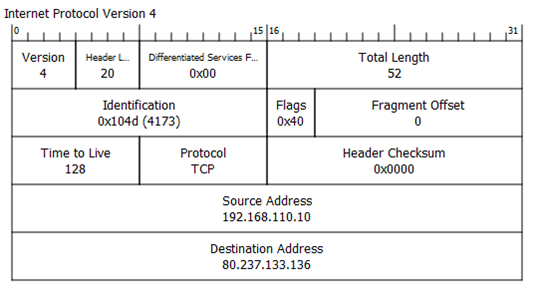
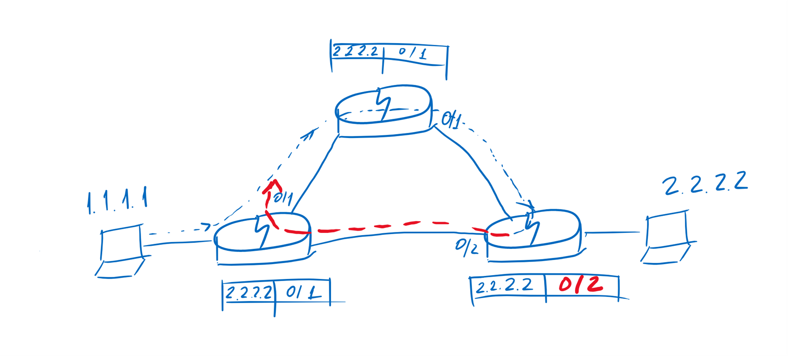
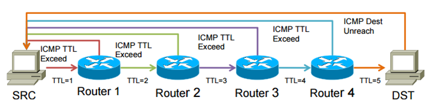
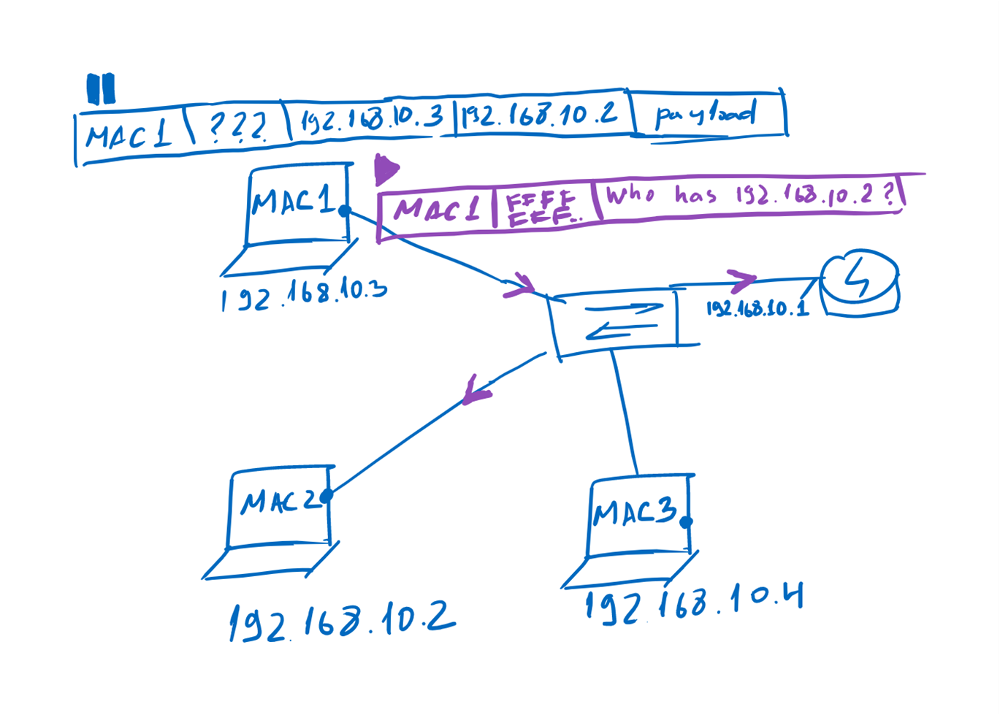
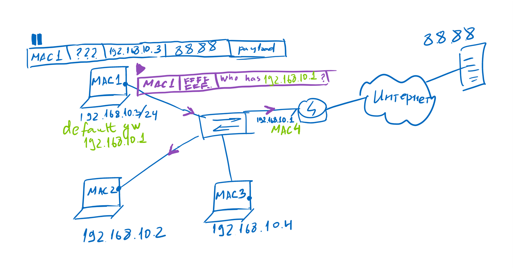

# Технология Ethernet. Протокол IP.
---
---

## 1. MTU и устройство Switch.
---

MTU(Maximum Transmission Unit; максимальная единица передачи) - максимальный рзамер пакета, который может быть передан по сети без фрагментации. Для Ethernet это значение составляет `1500 байт`.





Switch содержит и работает на своей операционной системе(с помощью которой мы управляем коммутатором):
1. Чипы ASIC - считывают заголовки L2 и отправляют информацию в конкретный порт.
Также чипы содержат высокоскоростную память, которая позволяет обращаться к конкретным MAC-адресам.
2. CPU со своей памятью.

`Задача коммутатора - пересылать пакет, который ему пришел с одного MAC на другой MAC, и не рассылать его на другие порты`

## 2. Таблица коммутации.
---

Каждый switch формирует у себя в память таблицу MAC-адресов(или таблицу коммутации).

Таблица делится на две части:
1. MAC-адрес.
2. Порт.

Каждому MAC-адресу соответствует свой порт.

`Важно - в таблице коммутации не должно происходить такого, когда MAC-адрес соответствует нескольким портам. Это ошибка, которую необходимо исправить, чтобы не попасть в коллизию или бесконечный цикл отправки пакетов.`

Также при работе с switch не может произойти коллизии, т.к. если корректно работает таблица коммутации и у нас везде стоит duplex соединение, то его не может возникнуть.

`Важное - если у нас стоит не duplex, то в данном случае, коллизия может появится, т.к. сигналы чисто физически могут столкнуться`



## 3. Broadcast MAC-адрес.
---

Этот MAC-адрес является служебным и предназначен для уведомления других участников сети о чём-либо.
Выглядит следующим образом:

`FF-FF-FF-FF-FF-FF` или `1111...1111`

Например, когда мы пытаемся отправить пакет от одного MAC до другого MAC, то цепочка будет выглядеть следующим образом:

- Формируется пакет, кроме одного поля - MAC distination. На моменте формирования пакета, если MAC не знает MAC получателя, то в поле distination он не знает, что записать, поэтому формирование встает на паузу.
- Формируется broadcast пакет
- MAC отправляет пакет на близжайший коммутатор, а тот в свою очередь рассылает его на все свои порты.
- MAC получатель получает пакет и отправляет результат на MAC отправитель

Область передачи Broadcast пакета называется - `Broadcast домен или L2-домен или широковещательный домен.`

## 4. Петля коммутации.
---



Broadcast шторм - это бесконтрольная отправка broadcast-пакетов, которые плодятся в геометрической прогрессии.

На примере выше:

- PC0 отправляет broadcast-пакет PC1
- Пакет приходит на Switch0
- Switch0 отправляет на Switch1 и Switch2
- Switch1 и Switch2 отправляют на свои порты пакет

Уже на этом моменте пакеты начинают летать между свитчами и плодится в геометрической прогрессии и сеть в какой-то момент падает.

Для того, чтобы таких ситуаций не появлялось используется протокол `STP - Spanning Tree Protocol`.

`Задача протокола - из топологии, где есть петли, создать топологию дерева. Фактически он на какое-то время отключает некоторые соединения(линки), а затем включает`

`Важно - STP не встроен в протокол Ethernet, и настраивается отдельно. Но чаще всего он уже вшит в сами коммутаторы`

## 3. Рассуждения о L2 и переход к L3 уровню.
---

На этапе, когда мы используем L2 для нас доступно:

- Протокол Ethernet и коммутаторы, с помощью которых мы можем построить небольшие сети
- MAC-адреса, которые позволяют идентифицировать сетевое оборудование

К сожалению на уровне L2 появляются проблемы с тем, что сеть заполонят broadcast-пакеты(даже работая на switch и используя STP), а также каждый пользователь будет знать, что кто-то что-то ищет.
Сети необходимо `фрагментировать и изолировать друг от друга`.
Для этого нужен `уровень L3.`

На сетевом уровне(L3) появляются такие понятия как:
- роутер
- IP-сеть

## 4. Сетевой уровень(L3), IP-адреса и роутер.
---

IP-адрес - предназначен для идентификации пользователя внутри IP-сети(L3 уровня).
`Адрес уникален и состоит из 4 октетов по 8 бит. Общий размер - 32 бита.`

`192.168.1.1` или `8.8.8.8` или любой другой в пределах от:

`{0-255}.{0-255}.{0-255}.{0-255}`

Роутер - это устройство которое соединяет IP-сети и принимает решение куда отправить пакет согласно таблице маршрутизации.
Эту таблицу можно сравнить с таблицей коммутации у switch.

Важное отличие роутера от коммутатора - `при попадании на роутер пакета с IP-адресом, которого нет за ним - он автоматически уничтожит пакет`.
Естественно роутер также может отправить сообщение отправителю, что он уничтожил пакет, по какой-то причине.

Данные в таблицу маршрутизации записываются не в виде списка IP-адресов, а в виде диапазонов, что упрощает чтение и обработку таблиц.

## 5. IP-адрес, IP-маска, IP-сеть.
---

Для того, чтобы собрать IP-сеть необходимо использовать - `IP-адрес и IP-маску.`

`192.168.123.10` - IP-адрес.
`255.255.255.0` - IP-маска.

В двоичной системе счисления, если мы сложим адрес и маску, то получится следующие значение:

```
11000000 10101000 01111011 00001010
11111111 11111111 11111111 00000000
-----------------------------------
11000000 10101000 01111011 00000000
```

В итоге благодаря маске сети мы решаем одну из задач - `распределение IP-адресов(хостов) в диапазоне от 0 до 255 на определенную IP-сеть.`

Если опираться на адрес 192.168.123.0, то диапазон его хостов с маской 24 - `192.168.123.0 - 192.168.123.255`.

То есть в сети с маской 24 мы сможем назначить 255 различных IP-адресов.

Когда прописывают IP-адрес с маской то используется следующая запись - `192.168.123.0/24`.

24 - маска сети. `24 - это количество единиц в двоичном коде, если разложить IP-адрес.`

Если же необходимо использовать в сети больше чем 255 хостов, то мы можем обнулить в 3 октете последнюю цифру. В итоге сеть удвоится.
Например:

---

`192.168.123.0`
`255.255.255.0`

```
11000000 10101000 01111011 00001010
11111111 11111111 11111111 00000000
-----------------------------------
11000000 10101000 01111011 00000000
```

`192.168.123.0 - 192.168.123.255`

Количество хостов - `255`.

---

---

`192.168.123.0`
`255.255.254.0`

```
11000000 10101000 01111010(1) 00001010
11111111 11111111 11111110 00000000
-----------------------------------
11000000 10101000 01111010 00000000
```

`192.168.122.0 - 192.168.123.255`

Количество хостов - `510`.

---

Операцию удваиванья адресов можно выполнять хоть сколько.
Точно также можно сокращать сеть двигая единицы в обратную сторону.

Легче всего вычислять количество хостов можно при помощь калькулятора.

`Важно - адреса 192.168.122.0(адрес сети) и 192.168.122.255(адрес broadcast рассылки) нельзя задавать для какого-то хоста. Они служебные и используются для конкретных целей`

## 6. Internet Protocol(IPv4).
---

Internet Protocol(IP, Интернет протокол или межсетевой протокол) является маршрутизируемым протоколом сетевого уровня. На основе протокола IP работает большинство современных сетей.



Пакет состоит из:
- Version - версия протокола
- Header Line - размер заголовка
- Differentiated Services - задает приоритет траффику
- Total Length - длинна заголовка с L3 пакетом
- Identification, Flags, Fragment Offset - предназначены для фрагментации пакетов
- Time to Live - время жизни пакета. Предотвращают петли на уровне L3.
- Protocol - указание следующего протокола для получателя
- Header Checksum - защищает пакет от изменений. Хранит в себе информацию сколько весил пакет при отправке от отправителя.
- Source Address - отправитель
- Destination Address - получатель

## 7. Петли и TTL.
---



В Windows TTL - 128 TTL, Linux - 64 TTL.

TTL - Time to Live.
TTL - это количество прыжков(хопов) между роутерами.

Как только роутер получит пакет с TTL равным 0 он его уничтожит, и отправит отправителю сообщение, что пакет уничтожен.

Это необходимо для того, чтобы пакеты не входили в петли и не клали сеть.

`На уровне L3 протокол TTL вшит в протокол IPv4.`

`На уровне L2 протокол STP не вшит в протокол Ethernet, и его приходилось настраивать отдельно.`

## 8. Утилита tracert.
---



Принцип работы программы:

1. Программа создает пакет у отправителя с полями - отправитель, получатель и TTL равным 1.
2. Пакет отправляется до близжайшего роутера и уничтожается.
3. Роутер отправляет сообщение программе, что время жизни пакета истекло, а близжайший роутер находится по такому-то адресу.
4. TTL++.
5. И так пакет будет отправляться/уничтожаться, пока не дойдет до получателя.

Главная особенность - если где-то на участке есть проблема и пакет не доходит до отправителя, то мы сможем это увидеть в программе tracert. Если в таблице маршрутизации роутера нет пути до IP-адреса, то пакет не отправится, `а в программе мы увидим в поле *`.

Таким образом мы можем понять, что где-то `в районе двух роутеров есть проблема`.

`Но к сожалению tracert не панацея`, и он не увидит например `farewall`, поэтому стоит пользоваться и другими утилитами.

## 9. ARP.
---

ARP - протокол позволяет составлять на MAC-адресах специальные ARP-таблицы, в которые записывает данные о участниках IP-сети, а также формирует ARP-запросы для ее заполнения.



Алгоритм ARP протокола:

1. MAC формирует пакет:
- IP-отправитель
- IP-получатель
- MAC-отправитель
- MAC-получатель(на этом моменте ставит пакет на паузу)

2. Создается ARP запрос и отправляется в IP-сеть, с вопросом - кто имеет IP-адрес такой-то, такой-то.
3. Пакет приходит на адрес получателя.
4. Получатель заносит информацию в ARP-таблицу об отправителе.
5. Информация об получателя отправляется назад отправителю
6. Отправитель заносит информацию в ARP-таблицу об получателе.
7. Пакет данных заполняет поле MAC-получателя.
8. Пакет отправляет получателю.

Таким образом участники IP-сети изучают других участников сети и записывают данные друг об друге.
В дальнейшем это позволяет не создавать ARP-запросы и пользоваться Unicast отправкой пакетов.

## 10. Gateway.
---

Если нам необходимо обратиться к MAC, находящемуся за нашей IP-сетью, то необходимо использовать Gateway.

Gateway - это роутер. Он имеет свой IP-адрес и прописывается у нас по дефолту.



Принцип действия такой же, как и у ARP протокола, но создается запрос на то, кто является gateway с таким-то таким-то IP.
Дальше все пакеты данных, которые уходят в другую IP-сеть будут проходить строго через роутер. Роутер уже сам автоматически их перенаправляет туда, куда необходимо.