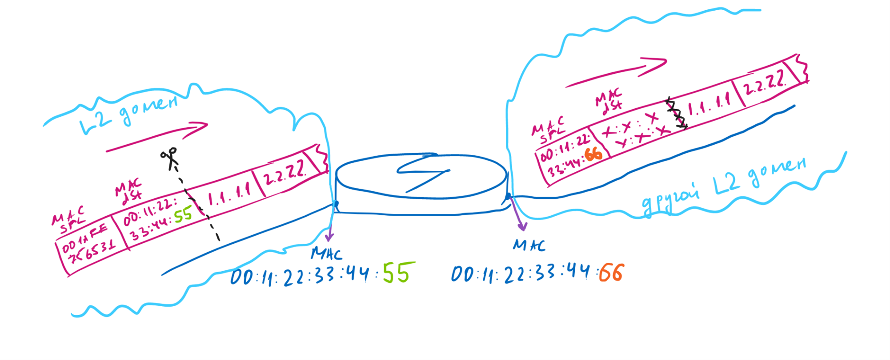
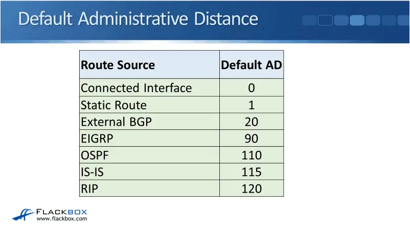
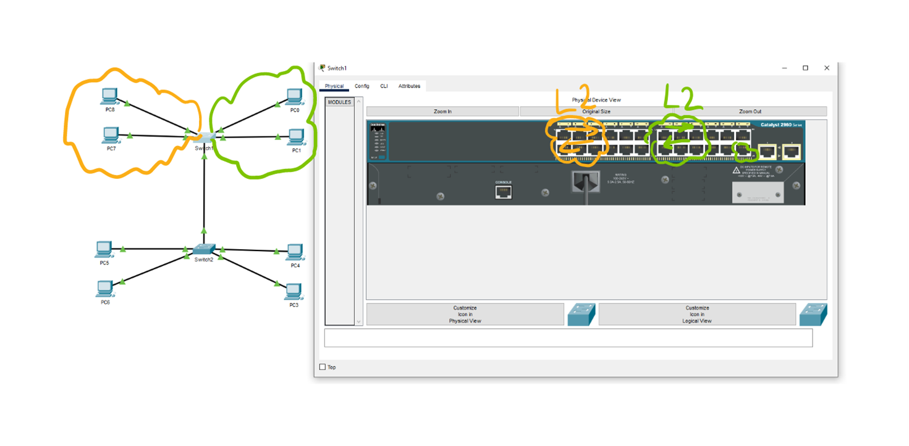
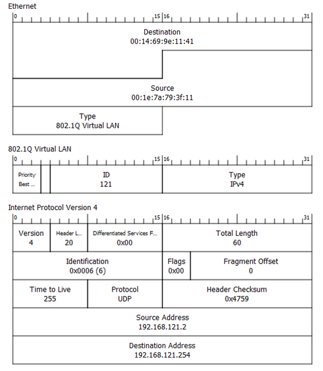
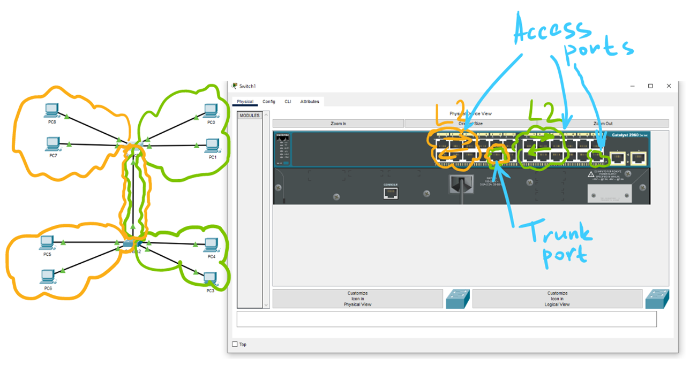

# Статическая маршрутизация. Динамическая маршрутизация. OSPF. VLAN.
---
## 1. Важные моменты по L2 и L3 уровням.
---



`Важный момент` - когда пакет прилетает на роутер, то видит L2 заголовок в пакете и отрезает его, а затем согласно таблице маршрутизации создает новый L2 заголовок и отправляет туда куда это необходимо.

`Таким образом от роутера к роутеру у нас меняется L2-заголовок, но не меняется L3-заголовок`

### Conntected Nets

Сети, которые подключены напрямую к роутеру называются - `Connected`

В таблице маршрутизации они обозначаются - `C`

### Static routes

Сети, которые лежат за другими роутерами необходимо прописывать статический маршрут.
Такие сети называются - `Static`

В таблице маршрузтизации обозначаются - `S`

## 2. Dynamic Routing

`Distance Vector - DV(BGP)` - динамический протокол построения сети, который работает по принципу - знаю только соседей.

Для построения WAN решили взять за основу DV, т.к. он не ресурсоёмкий(нет необходимости хранить на одном роутере всю карту сети).

`Link State - LS(Open Shortest Path First(OSPF) и Intermediate System to Intermediate System(IS-IS))` - динамический протокол построения сети, который работает по принципу - знаю всю сеть.

## 3. Карта сети в роутере.

Роутеры хранят карту сети в виде `графа`.

Граф состоит из вершин и рёбер.

Граф можно представить в виде множества, в которое входит путь от одной вершины до другой.

```
{
  {1,2}
  {2,1}
  {2,3}
  {3,2}
}
```

У ребра в компьютерной сети есть `вес`
Например если у нас есть соединение между одним и другим роутером, и скорость там 100 мб/с, а на другом соединении 50 мб/с, то 100 мб/с будет иметь больший вес.

Работа таких протоколов основана на `Алгоритме Дейкстры` по поиску кратчайшего пути.

## OSPF

Принцип работы:
1. Раз в 10 секунд роутер посылает `Hello packet` со всех своих включенных интерфейсов.

В этом пакете содержится - ID роутера(32bit), которое уникально в OSPF-сети и сообщает список своих соседей(neighbours).
Также этот пакет идёт на специальный IP-адреса и MAC-адреса.
По факту он работает как Broadcast рассылка.

2. Роутер принимает пакет и обрабатывает его:
- если роутер не участвует в OSPF, то он его уничтожит
- если роутер участвует в OSPF, то он запишет новый роутер в свой список OSPF
3. Роутер, который принял пакет пошлет свой hello-packet и расскажет другим роутерам, что у него в соседях есть другой роутер.
4. Как только hello-packet дойдет до роутера отправителя, то он также запишет роутер в свой OSPF список и появится так называемая связанность роутеров. Они будут передавать между собой данные о себе.

## DR, BDR и алгоритм

Для того, чтобы оптимизировать алгоритм Дейкстры OSPF протокол назначает DR роутер, который задает кратчайший путь до другого роутера.
Если ломается DR роутер, то создается BDR.

В каждом L2 домене выбираются свои DR и BDR.

Как только мы выбрали DR и BDR роутеры обмениваются между собой картами сети и входят в полную видимости. В итоге протокол Дейкстры отрабатывает намного эффективнее.

## Обрыв линка

В OSPF есть защита от обрыва линка. Если один из линков оборвется, то трафик пойдет по запасному пути

## ECMP-балансировка

Также если у нас есть два пути с одинаковым весом, то сработает ECMP-балансировка и трафик пойдет по двум линкам. В итоге скорость передачи пакетов вырастет.

## OSPF Areas

Для облегчения алгоритма Дейкстры также можно использовать area.

area 0 - BB, он как скелет.
К area 0 подключатся другие area через специальные роутеры - area border router.

В итоге получается так, что мы ищем кратчайший путь в каждой area, а затем через ABR передаём эти пути из area в area через протоколы DV.

## Условия связанности OSPF

1. Одинаковый hello-interval
Если меньше 10 секунд, то сосед начинает подозревать, что с ним что-то не так
2. Одинаковый dead-interval
Максимум 4 пакета дозволительно потерять
3. Одна IP-сеть на встречных интерфейсах
4. Одна Area на встречных интерфейсах
5. Одинаковый MTU на встречных интерфейсах
6. Уникальный Router ID

## Administrative Distance

Это протокол, который решает по какому протоколу будут отправлять данные по одинаковому маршруту.



## VLAN

VLAN - это технология позволяющая создать несколько L2 доменов на одном коммутаторе.

Эта технология позволяет разделить отдельные IP-сети за коммутатором от доступа лиц, которые не закреплены за этой сетью. По факту мы закрепляем за конкретным портом на коммутаторе выход на какую-то VLAN сеть и доступ туда будет у ограниченного круга лиц.

Также эта технология позволяет экономить на switch, т.к. мы можем настроить несколько IP-сетей на одном switch.







Access port - от коммутатор до хоста
Trunk port - от коммутатора до других устройств